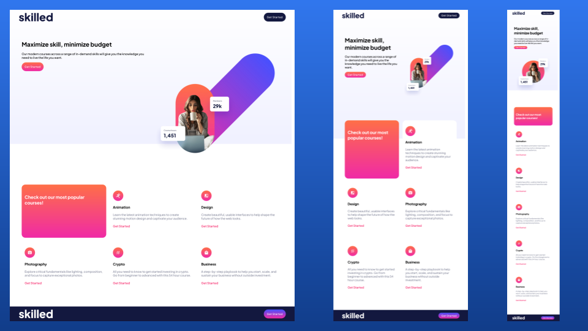

# Skilled e-learning landing page solution

## Table of contents

- [Overview](#overview)
  - [The challenge](#the-challenge)
  - [Screenshot](#screenshot)
  - [Links](#links)
- [My process](#my-process)
  - [Built with](#built-with)
- [Author](#author)

## Overview

### The challenge

Users should be able to:

- View the optimal layout depending on their device's screen size
- See hover states for interactive elements

### Screenshot

### Links

- Solution URL: [github](https://github.com/emmanuelkech/e-learning-landing-page)
- Live Site URL: [github pages](https://emmanuelkech.github.io/e-learning-landing-page/)

## My process

### Built with

- Semantic HTML5 markup
- CSS custom properties
- CSS Grid

## Author

- Website - [https://emmanuelkech.github.io/e-learning-landing-page/](https://emmanuelkech.github.io/e-learning-landing-page/)
- Frontend Mentor - [@emmanuelkech](https://www.frontendmentor.io/profile/emmanuelkech)
- Twitter - [@perfectdynamite](https://www.twitter.com/perfectdynamite)
- LinkedIn - [Emmanuel Ikechukwu](https://www.linkedin.com/in/emmanuel-ikechukwu-018032b4/)

